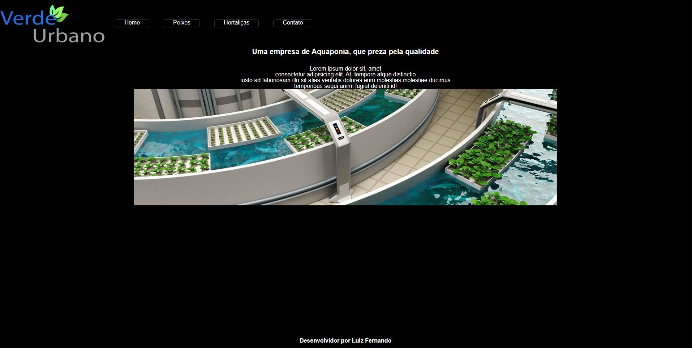
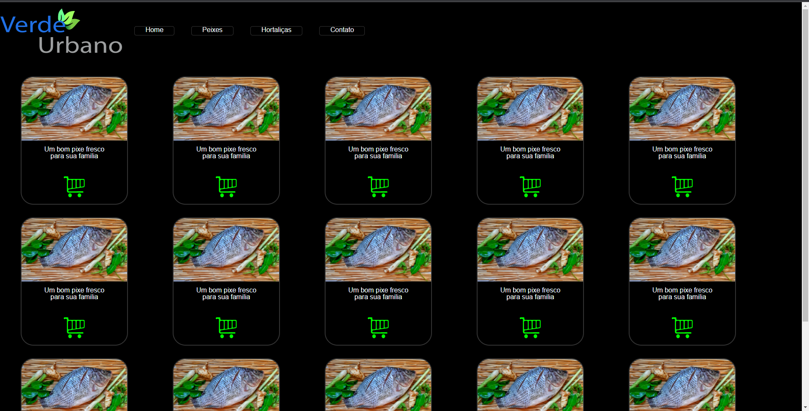
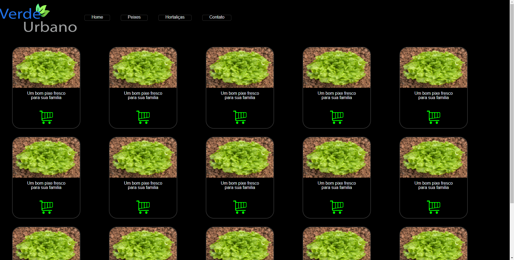
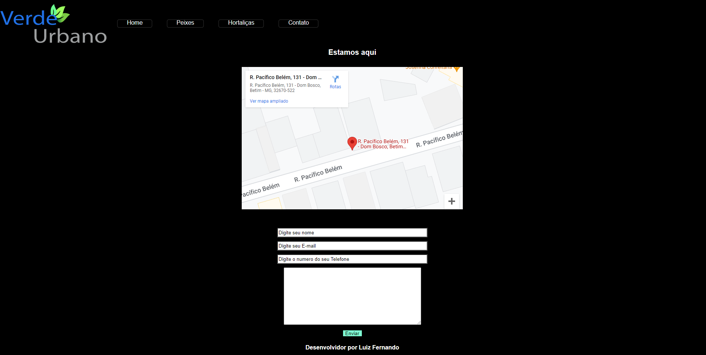

# Projeto E-commerce Verde Urbano

## Tecnologias Utilizadas

<div style="display: inline_block">
    
    
    
    
    
    
    

</div>
<br>

#


## Licença vinculada ao repositório
[](https://github.com/LuizFernandoDeveloper/E-commerce-VerdeUrbano/blob/main/LICENSE)

#

  <h2> Esse é um projeto de um e-commerce que vendera produtos relacionados a aquaponia </h2><br>

  - Estamos a desenvolver a pagina Home, no momento enfrento dificuldate de achar um design ideal.
   
   
  - Pagina que ficara todas as especies de peixes que a empresa tem a disposição para vender e pagina das hotaliças. No momento estou optando por esse design na pagina dos peixes e hortaliças.
   
  <br>
  <br>
   
 
  - Vamos ter também uma pagina para contato que estou a pensar sobre o desing da mesma.
    
  #
   
### Ajustes e melhorias

O projeto ainda está em desenvolvimento e as próximas atualizações serão voltadas nas seguintes tarefas:

- [ ] Melhoria no desing da pagina home
- [ ] Melhoria no desing da pagina contatos
- [ ] Adiciona pagina para login 
- [ ] Testar o frontend
- [ ] Iniciar o Backend
- [ ] Desenvolver sistema IOT para a empresa
#


Antes de começar, verifique se você atendeu aos seguintes requisitos:

* Você deve instalar `<Java 11+ / STS / node / Angular cli / vscode >`.
* Sistema operacional compatível: `<Windows / Linux / Mac>`.


## 🚀 Clone e-commerce-VerdeUrbano

Para Clonar o e-commerce-VerdeUrbano, siga estas etapas:

Linux e macOS:
```
git clone https://github.com/LuizFernandoDeveloper/E-commerce-VerdeUrbano.git
```

Windows:
```
git clone https://github.com/LuizFernandoDeveloper/E-commerce-VerdeUrbano.git
```


## 📫 Contribuindo para e-commerce-VerdeUrbano

Para contribuir com Critique seus Filmes, siga estas etapas:

1. Bifurque este repositório.
2. Crie um branch: `git checkout -b <nome_branch>`.
3. Faça suas alterações e confirme-as: `git commit -m '<mensagem_commit>'`
4. Envie para o branch original: `git push origin <nome_do_projeto> / <local>`
5. Crie a solicitação de pull.

#

## 🤝 Colaboradores

Agradecemos às seguintes pessoas que contribuíram para este projeto:

<table>
  <tr>
    <td align="center">
      <a href="#">
        <br>
        <sub>
          <b>Luiz Fernando Rodrigues</b>
        </sub>
      </a>
    </td>
   
 
</table>

# O que é aquaponia ?
  Aquaponia é um sistema de cultivo que une a Piscicultura (cultivo de peixes) e a Hidroponia (cultivos de plantas sem o <br>uso de solo, com as raízes submersas na água).<br>

É um sistema que resolve um problema da piscicultura solucionando um problema da hidroponia.<br>

Basta alimentar os peixes que o ciclo se fecha. O excremento produzido pelos peixes é rico em nutrientes que alimentam as <br>plantas que por sua vez filtram a água para o peixe.<br>

Os dois sistemas estão fisicamente separados e são interligados por um sistema de bombeamento que leva a água com fezes <br> de peixe para o sistema hidropônico e devolve a água limpa do sistema hidropônico para o tanque com os peixes.<br>

Esse sistema ja existe há 30 anos nos países asiáticos, Australia e nos EUA.
</p>


#


[⬆ Voltar ao topo](https://github.com/LuizFernandoDeveloper/E-commerce-VerdeUrbano)<br>

#
 
